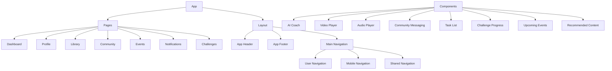

# Papa - Modern Learning Platform

Papa is a comprehensive learning platform built with Next.js, offering a rich set of features for education and personal development. The platform combines AI coaching, community engagement, and interactive content delivery.

## 🚀 Features

- **AI Coaching**: Personalized learning assistance and guidance
- **Community Engagement**: Interactive messaging and collaboration
- **Content Library**: Access to video and audio learning materials
- **Event Management**: Track and participate in learning events
- **Challenge System**: Gamified learning through challenges
- **Task Management**: Organize and track learning objectives
- **User Profiles**: Personalized learning experience
- **Responsive Design**: Optimized for all devices

## 🛠️ Tech Stack

- **Framework**: Next.js 15.2.4
- **Language**: TypeScript
- **UI Library**: React 19
- **Styling**: Tailwind CSS
- **UI Components**: Radix UI
- **State Management**: Zustand
- **Form Handling**: React Hook Form + Zod
- **Date Handling**: date-fns
- **Charts**: Recharts
- **AI Integration**: Google Generative AI
- **Animations**: Tailwind Animate
- **Icons**: Lucide React

## 📁 Project Structure



## 🚀 Getting Started

### Prerequisites

- Node.js (v18 or higher)
- npm or pnpm

### Installation

1. Clone the repository:
   ```bash
   git clone [repository-url]
   ```

2. Install dependencies:
   ```bash
   npm install
   # or
   pnpm install
   ```

3. Create a `.env.local` file in the root directory and add your environment variables:
   ```
   NEXT_PUBLIC_API_URL=your_api_url
   GOOGLE_AI_API_KEY=your_google_ai_key
   ```

4. Start the development server:
   ```bash
   npm run dev
   # or
   pnpm dev
   ```

5. Open [http://localhost:3000](http://localhost:3000) in your browser.

## 📦 Available Scripts

- `npm run dev` - Start development server
- `npm run build` - Build for production
- `npm run start` - Start production server
- `npm run lint` - Run ESLint

## 🧪 Development

### Code Style

- Follow TypeScript best practices
- Use ESLint for code linting
- Follow the project's component structure
- Use Tailwind CSS for styling

### Component Structure

Components are organized in the `components` directory with the following structure:
- `ui/` - Reusable UI components
- Feature-specific components in the root of `components/`

### State Management

- Use Zustand for global state management
- Use React Hook Form for form state
- Use React Context for theme and authentication

## 🔧 Configuration

The project uses several configuration files:
- `next.config.mjs` - Next.js configuration
- `tailwind.config.ts` - Tailwind CSS configuration
- `tsconfig.json` - TypeScript configuration
- `postcss.config.mjs` - PostCSS configuration

## 🤝 Contributing

1. Fork the repository
2. Create your feature branch (`git checkout -b feature/amazing-feature`)
3. Commit your changes (`git commit -m 'Add some amazing feature'`)
4. Push to the branch (`git push origin feature/amazing-feature`)
5. Open a Pull Request

## 📝 License

This project is licensed under the MIT License - see the [LICENSE](LICENSE) file for details.

## 🙏 Acknowledgments

- Next.js team for the amazing framework
- Radix UI for the accessible components
- Tailwind CSS for the utility-first CSS framework
- All contributors and maintainers
