```mermaid
graph TD
    %% Main Application Structure
    App[App] --> Layout[Layout]
    App --> Pages[Pages]
    
    %% Pages
    Pages --> Dashboard[Dashboard]
    Pages --> Profile[Profile]
    Pages --> Library[Library]
    Pages --> Community[Community]
    Pages --> Events[Events]
    Pages --> Notifications[Notifications]
    Pages --> Challenges[Challenges]
    
    %% Components
    Layout --> Header[App Header]
    Layout --> Footer[App Footer]
    Layout --> Navigation[Main Navigation]
    
    %% UI Components
    Navigation --> UserNav[User Navigation]
    Navigation --> MobileNav[Mobile Navigation]
    Navigation --> SharedNav[Shared Navigation]
    
    %% Feature Components
    Components[Components] --> AICoach[AI Coach]
    Components --> VideoPlayer[Video Player]
    Components --> AudioPlayer[Audio Player]
    Components --> CommunityMessaging[Community Messaging]
    Components --> TaskList[Task List]
    Components --> ChallengeProgress[Challenge Progress]
    Components --> UpcomingEvents[Upcoming Events]
    Components --> RecommendedContent[Recommended Content]
    
    %% Styling
    Styles[Styles] --> Tailwind[Tailwind CSS]
    Styles --> GlobalCSS[Global CSS]
    
    %% Configuration
    Config[Configuration] --> NextConfig[Next.js Config]
    Config --> TailwindConfig[Tailwind Config]
    Config --> TypeScript[TypeScript Config]
    
    %% Dependencies
    Dependencies[Dependencies] --> NextJS[Next.js]
    Dependencies --> React[React]
    Dependencies --> TypeScript[TypeScript]
    Dependencies --> Tailwind[Tailwind CSS]
```

## Project Structure Overview

This MermaidJS diagram represents the main structure of the Papa project, which appears to be a Next.js application with various features including:

- User profiles and navigation
- AI coaching functionality
- Video and audio content
- Community features
- Event management
- Challenge tracking
- Task management

The project follows a modern Next.js architecture with:
- App directory for routing
- Components directory for reusable UI elements
- Styles directory for styling
- Configuration files for Next.js, TypeScript, and Tailwind CSS 